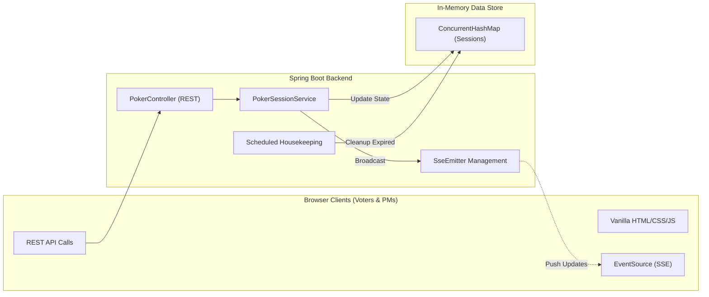

# Agile Poker Estimation (Spring Boot)

A modern, real-time Agile Poker (Planning Poker) estimation tool built with Spring Boot and native web technologies.

## 🏛️ High-Level Architecture

The application follows a lightweight, real-time event-driven architecture designed for low latency and high scalability in ephemeral sessions.



### Components
- **Real-Time Synchronization**: Uses **Server-Sent Events (SSE)** via Spring's `SseEmitter`. Unlike WebSockets, SSE is unidirectional (Server → Client), making it lighter and more efficient for state broadcasting while standard REST takes care of client actions.
- **State Management**: Distributed state is managed in-memory using thread-safe `ConcurrentHashMap`. This ensures rapid response times without the overhead of a database for ephemeral voting sessions.
- **Modular Frontend**: A strictly decoupled frontend architecture using native Web APIs. Assets are modularized into `.html`, `.css`, and `.jvx` files, allowing for clean maintenance without complex build tools.

---

## 🚀 Getting Started

### Prerequisites
- Java 21+
- Gradle (provided via `./gradlew`)

### Run Locally
```bash
./gradlew bootRun
```
The server will start at `http://localhost:8080`.

---

## 🛠️ Tech Stack & Features

- **Backend**: Spring Boot 4.0.3, Java 21.0.6.
- **Frontend**: Vanilla HTML5, CSS3, and JavaScript (Modular).
- **Theme Engine**: Integrated Dark/Light mode selection with cookie persistence.
- **UX Excellence**: 
    - Real-time voting grid updates.
    - Animation feedback (shake effects on errors).
    - Audio cues (success/error pings).
    - Persistent Voter Name (saved for 30 days).
- **Session Lifecycles**: Automatic data expiration and cleanup (24-hour TTL).

---

## 🛰️ API Documentation

Swagger UI is available at **[/swagger-ui.html](http://localhost:8080/swagger-ui.html)** when running.

### Key Endpoints

| Method | Endpoint | Description |
|---|---|---|
| `GET` | `/api/sessions` | List all active sessions |
| `POST` | `/api/sessions` | Create a new estimation session |
| `POST` | `/api/sessions/{id}/topics` | Add a new topic (PM only) |
| `POST` | `/api/sessions/{id}/topics/{tId}/reveal` | Reveal votes for a topic (PM only) |
| `POST` | `/api/sessions/{id}/topics/{tId}/vote` | Cast or update a vote |
| `GET` | `/api/sessions/stream/{id}` | SSE stream for real-time updates |

---

## 🧹 Session Cleanup
- **Automatic**: A Background task runs every hour to remove sessions older than 24 hours.
- **Manual**: Sessions can be manually purged via `DELETE /api/sessions?hours=N`.

---

## 🎨 Theme Support
The application supports persistent Dark and Light modes.
- **Dark Mode (Default)**: Deep blue aesthetic (`#0f172a`).
- **Light Mode**: Clean, airy interface (`#f8fafc`).
- Preferences are stored in the `appTheme` cookie.

---

## 🛡️ PM Dashboards
The PM view is protected by a 3-digit access code generated at session creation. PMs can:
- Create new topics dynamically.
- Reveal votes (closing the topic).
- View all participants' IP addresses and real-time voting status.